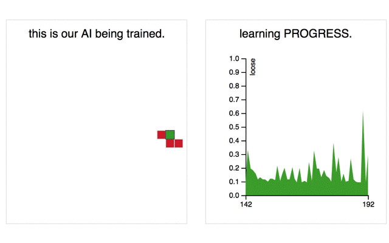

# deep-snake
A snake game trained using simple deep learning implemented in client side javascript.

### [Demo: deep-snake.herokuapp.com](https://deep-snake.herokuapp.com/)

*NOTE:* The page will only run correctly in ES6 compatible (newer) browsers.

## What is this?
My goal was to create a simple demo of deep learning which is:
- very small, but still funny
- not too artificial
- demonstrating learning effect in minutes
- easy to read and modify

It is a toy. You can see how the snake is trained and gets gradually better.
The whole deep learning "magic" is happening in your browser. By reloading the page you are wiping Snake's
"brain". The complete code including visualization and the logic of the game is less then 500 lines.

# Frameworks Used
- [ConNetJS](https://cs.stanford.edu/people/karpathy/convnetjs/) - for deep learning.
- [D3.js](https://d3js.org/) - for visualization.
